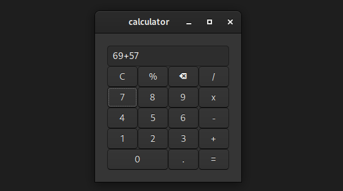

# Basic GUI Calculator

## Description
Simple GUI calculator made using C programming language and GTK toolkit.

## Getting Started
### Installations
* [GCC](https://www.google.com/search?q=cc) compiler
* gtk toolkit

### How to run
#### Step 0:
To run this code use:
```
git clone https://github.com/doer08736/basicGUICalculator
```
Head on the directory:
```
cd basicGUICalculator
```

#### Step 1:
Install development files for GTK+ library

Debian
```
sudo apt install libgtk-3-dev -y
```

Arch Linux
```
sudo pacman -S lib3atk-dev --noconfirm
```

#### Step Z:
Compile and run:
```
gcc calculator.c `pkg-config --cflags --libs gtk+-3.0`; ./a.out
```

## Help
If you getting trouble running the code please [google](https://www.google.com) the errors.

## Authors
[doer08736](https://github.com/doer08736)

## Conculsion
The End.
